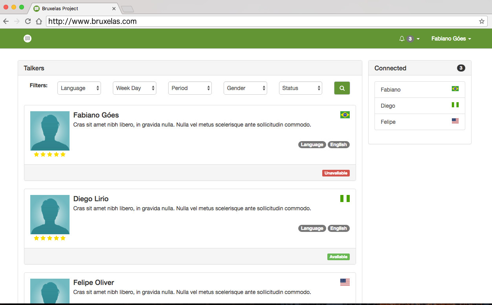

# Bruxelas
Bruxelas Project - Connect to Practice

### Technologies   

* Spring Boot
* Spring MVC
* Spring Data
* Angular 1
* Bootstrap 3
* Spring Social
* Spring Security

------   

### Bruxelas Project Backend

**Production Environment**

```   
CREATE SCHEMA bruxelas DEFAULT CHARACTER SET utf8;
CREATE USER 'bruxelas'@'localhost' IDENTIFIED BY 'bruxelas';
GRANT ALL PRIVILEGES ON * . * TO 'bruxelas'@'localhost';
```   

> set Profile = prod   

``` 
spring.profiles.active=prod
```   

------    

### Bruxelas Project Frontend

**Development Environemnt**   

```
$ npm install && grunt build
```

------    

http://bruxelas-fabianoggoes.rhcloud.com/



------

**Openshift Data**

>  WildFly 9 administrator added.  Please make note of these credentials:
>
>   Username: adminWa3FYT4
>   Password: BZrsRpcmSplb
>   
>   run 'rhc port-forward bruxelas' to access the web admin area on port 9990.

------   

[](https://travis-ci.org/fabianogoes/bruxelas)
