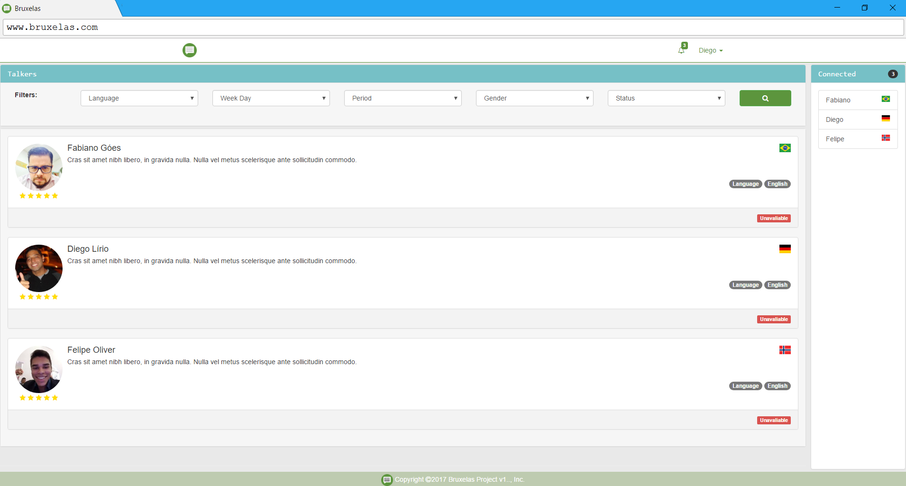

# Bruxelas
Bruxelas Project - Connect to Practice

### Technologies   

* Spring Boot
* Spring MVC
* Spring Data
* Angular 1
* Bootstrap 3
* Spring Social
* Spring Security

------    

http://bruxelas-fabianoggoes.rhcloud.com/

------

- Default User
Insert Into user(email, password) values('maggierogers@bruxelas.com.br', '123456');
- Talker
Insert Into talker(birth_date, name, born_in_id, user_id) 
 values ('1999-12-19', 'Maggie Rogers', 1, (select u.id from user u where u.email = 'maggierogers@bruxelas.com.br' ));
